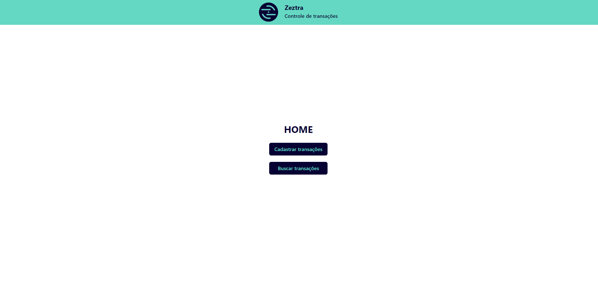
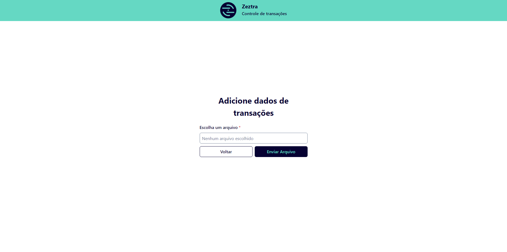
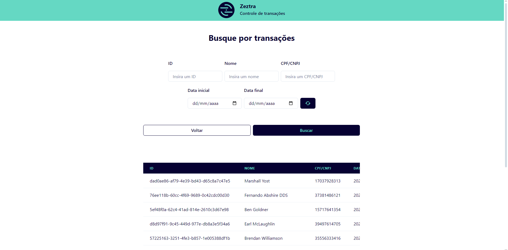

<p  align="center"  width="100%">


</p>

## Desafio FullStack Zeztra

# Projeto de Registro e Busca de Transações

Este projeto é composto por uma aplicação backend e frontend. O backend oferece duas rotas principais: uma para registrar transações a partir de um arquivo `.txt`, e outra para buscar transações previamente cadastradas. O frontend, por sua vez, apresenta uma interface com uma página inicial e duas páginas adicionais, cada uma delas responsável por realizar uma ação específica: cadastrar transações e buscar transações.

## Estrutura do projeto

A aplicação é dividida em duas partes:

- **Backend**: Oferece uma API com duas rotas:

  - `/transaction` (POST): para registrar transações a partir de um arquivo.
  - `/transaction` (GET): para buscar transações cadastradas com base em filtros como CPF/CNPJ, ID da transação, datas, entre outros.

- **Frontend**: Uma interface simples com três páginas:

  - **Home**: Página inicial de boas-vindas.
  <p  align="center"  width="100%">
    
  </p>

  - **Registrar Transações**: Página para enviar um arquivo `.txt` e registrar transações.
  <p  align="center"  width="100%">
    
  </p>

  - **Buscar Transações**: Página para realizar buscas de transações já registradas, utilizando filtros de busca variados.
  <p  align="center"  width="100%">
    
  </p>

## Requisitos

Para rodar a aplicação, você precisará ter os seguintes requisitos instalados:

- [Node.js](https://nodejs.org/) (inclui npm)
- [Docker](https://www.docker.com/) com [Docker Compose](https://docs.docker.com/compose/)

## Como rodar a aplicação

### Backend

1. Navegue até o diretório do backend:
   ```bash
   cd backend
   ```
2. Suba os containers Docker necessários:
   ```bash
   docker-compose up -d
   ```
3. Instale as dependências do projeto:
   ```bash
   npm install
   ```
4. Inicie o servidor de desenvolvimento:
   ```bash
   npm run dev
   ```

### Frontend

1.  Navegue até o diretório do frontend:
    ```bash
    cd frontend`
    ```
2.  Instale as dependências do projeto:
    ```bash
    npm install`
    ```
3.  Inicie o servidor de desenvolvimento:
    ```bash
    npm run dev`
    ```

## Testando o backend com cURL

### Rota: Register Transactions

Para cadastrar transações enviando um arquivo `.txt`:

```bash
curl --request POST \
--url http://localhost:3333/transaction \
--header 'Content-Type: multipart/form-data' \
--form 'file=@[PATH_FILE]'
```

Substitua `[PATH_FILE]` pelo caminho real do arquivo `.txt` que deseja enviar.

### Rota: Search Transactions

Para buscar transações cadastradas:

```bash
curl --request GET \
--url 'http://localhost:3333/transaction?cpfCnpj=&transactionId=&startDate=&endDate=&name=&page=&pageSize='
```

Preencha os parâmetros da URL com os valores desejados para filtrar as transações.

## Acessando o Portal

Com o backend e o frontend em execução, basta acessar `http://localhost:3000` no seu navegador. A partir daí, você poderá navegar pelo portal e utilizar as funcionalidades de cadastro e busca de transações de forma correta.
